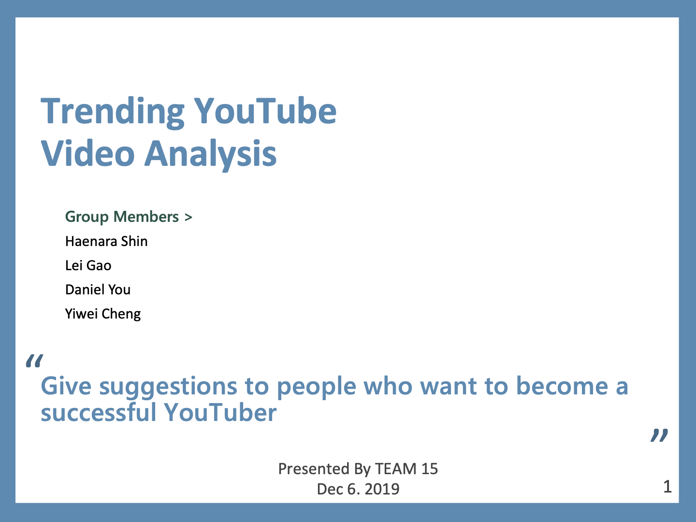

- Who: the group project (4 people including myself)
  - I was in charge of writing all codes related to the data crwaling through Google YouTube API and Kaggle, and its EDA.
- When: Sept. 2019 - Dec. 2019
- Where: ECE 143 (Programming for Data Analysis) group project
- What: Analysis of YouTube trending videos and give suggestions to people who want to become a successful YouTuber
- Tech: Python || Data scrapping(requests, argparse) || EDA(Pandas, Numpy, Seaborn, matplotlib, wordcloud)
- [The repository](https://github.com/haenara-shin/YouTube-Trending-Videos-Analysis-Team15-FA19.git) is open to the public.
